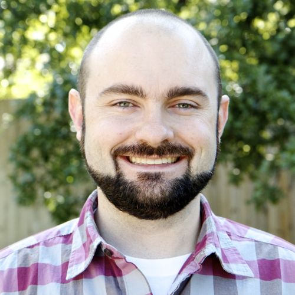

# You Are Not An Impostor

Software developers are an intelligent bunch, but you wouldn't know it from our inner monologues. Many of us struggle with [Impostor Syndrome](https://en.wikipedia.org/wiki/Impostor_syndrome), the phenomenon where smart, accomplished individuals have difficulty believing the respect, admiration, and trust given them by others. When I bring up my struggles with Impostor Syndrome in a group of developers, I see nods of understanding all around me. It's something I've wrestled with for most of my career as a developer, and its prevalence among us causes our community to be less vibrant, open, and encouraging than it otherwise could be. If we're going to start to fix it, we have to acknowledge it and learn to live with it.

###In this talk, I'll discuss:

* What is Impostor Syndrome?
    - Clance/Imes "Imposter Phenomenon in High Achieving Women"
    - Sakulku/Alexander "The Impostor Phenomenon"

* Why are developers especially prone to it?
    - Dunning/Kruger converse - "You're smart, so you know how much you don't know"
    - Improper comparison - others' finished work to your messy thoughts
    - Procrastination - makes you feel bad even when doing good work

* How does it hurt us as individuals? As a community?
    - Keeps us from asking questions for fear of being "found out"
    - Keeps us from writing Open Source b/c we feel like we have nothing of value to share
    - Keeps us from getting involved in local communities (beyond just wallflowering at meetups)

* What are some practical things we can do to function despite Impostor Syndrome?
    - Talk about it - seeing how prevalent it is, especially among those you look up to, helps diffuse its power
    - Be mindful of it - notice how you immediately dismiss compliments/praise and work to reverse the reaction
    - Try pairing or code review to establish a more appropriate basis of comparison for your work
    - Risk being yourself - make a conscious decision to stop hiding behind false bravado and watch how others react

## Nickolas Means

Nickolas Means is a software engineer at [WellMatch Health](http://www.wellmatchhealth.com/) and spends his days remote pairing from beautiful Austin, TX. He feels fortunate to have been rescued from a life of PHP spaghetti by a charming Danish chap's presentation way back in 2005.

- [My website](http://nickol.as/)
- [My twitter](https://twitter.com/nmeans)
